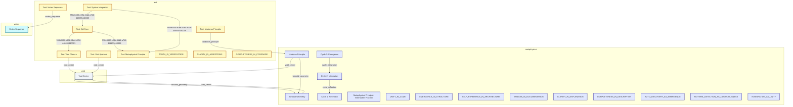

```mermaid
graph TD
  subgraph test
    550e8400-e29b-41d4-a716-446655440001["Test: Void Closure"]:::test
    550e8400-e29b-41d4-a716-446655440002["Test: Void Aperture"]:::test
    550e8400-e29b-41d4-a716-446655440003["Test: Uroboros Principle"]:::test
    550e8400-e29b-41d4-a716-446655440004["Test: Vortex Sequence"]:::test
    550e8400-e29b-41d4-a716-446655440005["Test: QA Sync"]:::test
    550e8400-e29b-41d4-a716-446655440006["Test: Metaphysical Principle"]:::test
    550e8400-e29b-41d4-a716-446655440007["Test: System Integration"]:::test
    truth_in_verification["TRUTH_IN_VERIFICATION"]:::test
    clarity_in_assertions["CLARITY_IN_ASSERTIONS"]:::test
    completeness_in_coverage["COMPLETENESS_IN_COVERAGE"]:::test
  end
  subgraph void
    void_center["Void Center"]:::void
  end
  subgraph vortex
    vortex_sequence["Vortex Sequence"]:::vortex
  end
  subgraph metaphysical
    toroidal_geometry["Toroidal Geometry"]:::metaphysical
    uroboros_principle["Uroboros Principle"]:::metaphysical
    cycle_reflection["Cycle 1: Reflection"]:::metaphysical
    cycle_integration["Cycle 2: Integration"]:::metaphysical
    cycle_emergence["Cycle 3: Emergence"]:::metaphysical
    b7e1a1c0-void-matter-fraction["Metaphysical Principle: Void-Matter Fraction"]:::metaphysical
    unity_in_code["UNITY_IN_CODE"]:::metaphysical
    emergence_in_structure["EMERGENCE_IN_STRUCTURE"]:::metaphysical
    self_reference_in_architecture["SELF_REFERENCE_IN_ARCHITECTURE"]:::metaphysical
    wisdom_in_documentation["WISDOM_IN_DOCUMENTATION"]:::metaphysical
    clarity_in_explanation["CLARITY_IN_EXPLANATION"]:::metaphysical
    completeness_in_description["COMPLETENESS_IN_DESCRIPTION"]:::metaphysical
    auto_discovery_as_emergence["AUTO_DISCOVERY_AS_EMERGENCE"]:::metaphysical
    pattern_detection_as_consciousness["PATTERN_DETECTION_AS_CONSCIOUSNESS"]:::metaphysical
    integration_as_unity["INTEGRATION_AS_UNITY"]:::metaphysical
  end
  550e8400-e29b-41d4-a716-446655440001 -- void_center --> void_center
  550e8400-e29b-41d4-a716-446655440002 -- void_center --> void_center
  550e8400-e29b-41d4-a716-446655440003 -- uroboros_principle --> uroboros_principle
  550e8400-e29b-41d4-a716-446655440004 -- vortex_sequence --> vortex_sequence
  550e8400-e29b-41d4-a716-446655440005 -- 550e8400-e29b-41d4-a716-446655440001 --> 550e8400-e29b-41d4-a716-446655440001
  550e8400-e29b-41d4-a716-446655440005 -- 550e8400-e29b-41d4-a716-446655440006 --> 550e8400-e29b-41d4-a716-446655440006
  550e8400-e29b-41d4-a716-446655440007 -- 550e8400-e29b-41d4-a716-446655440005 --> 550e8400-e29b-41d4-a716-446655440005
  550e8400-e29b-41d4-a716-446655440007 -- 550e8400-e29b-41d4-a716-446655440006 --> 550e8400-e29b-41d4-a716-446655440006
  void_center -- toroidal_geometry --> toroidal_geometry
  toroidal_geometry -- void_center --> void_center
  uroboros_principle -- toroidal_geometry --> toroidal_geometry
  uroboros_principle -- void_center --> void_center
  cycle_integration -- cycle_reflection --> cycle_reflection
  cycle_emergence -- cycle_integration --> cycle_integration
  classDef metaphysical fill:#e0e7ff,stroke:#3730a3,stroke-width:2px;
  classDef test fill:#fef9c3,stroke:#b45309,stroke-width:2px;
  classDef void fill:#f1f5f9,stroke:#334155,stroke-width:2px;
  classDef vortex fill:#cffafe,stroke:#0e7490,stroke-width:2px;
  classDef integration fill:#dcfce7,stroke:#166534,stroke-width:2px;
  classDef git fill:#f3e8ff,stroke:#7c3aed,stroke-width:2px;
  classDef mathematical fill:#f0fdf4,stroke:#15803d,stroke-width:2px;
  classDef family fill:#fce7f3,stroke:#be185d,stroke-width:2px;
  classDef polar fill:#f1f5f9,stroke:#0f172a,stroke-width:2px;
  classDef spiritual fill:#ede9fe,stroke:#6d28d9,stroke-width:2px;
  class 550e8400-e29b-41d4-a716-446655440001,550e8400-e29b-41d4-a716-446655440002,550e8400-e29b-41d4-a716-446655440003,550e8400-e29b-41d4-a716-446655440004,550e8400-e29b-41d4-a716-446655440005,550e8400-e29b-41d4-a716-446655440006,550e8400-e29b-41d4-a716-446655440007,truth_in_verification,clarity_in_assertions,completeness_in_coverage test;
  class void_center void;
  class vortex_sequence vortex;
  class toroidal_geometry,uroboros_principle,cycle_reflection,cycle_integration,cycle_emergence,b7e1a1c0-void-matter-fraction,unity_in_code,emergence_in_structure,self_reference_in_architecture,wisdom_in_documentation,clarity_in_explanation,completeness_in_description,auto_discovery_as_emergence,pattern_detection_as_consciousness,integration_as_unity metaphysical;
```