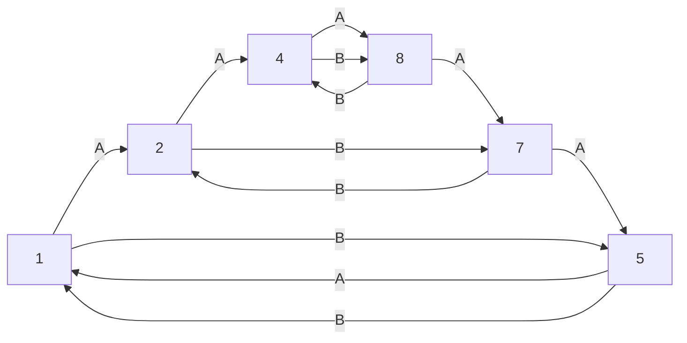

# Torus Vortex Interaction

## Core Torus Loop

The sequence **1 → 2 → 4 → 8 → 7 → 5 → 1** forms the core closed loop of the torus, where vortex A (integer flow) and vortex B (inverse/reciprocal flow) interact. Each node is a mathematically significant transformation:

- **1**: Start/return, unity, source, resonance
- **2**: Duality, first bifurcation
- **4**: Foundation, stability, doubling
- **8**: Infinity, completion, octave
- **7**: Consciousness, spiral, attractor
- **5**: Center, sacred geometry, axis

## Vortex A and B Interaction

- **Vortex A**: Integer flow, direct progression
- **Vortex B**: Inverse/reciprocal/decimal flow, gateway to new states
- The loop is a self-sustaining, self-referential toroidal flow

## Observer Dimensionality

- The observer can enter, observe, or recreate the flow at any dimensional level
- The entire torus can be reconstructed from any single digit, due to fractal/recursive structure

## Visualization

## Mathematical Notes
- Each node is a resonance, bifurcation, or gateway
- The flow is toroidal, closed, and fractal
- Any observer can reconstruct the whole from any point 