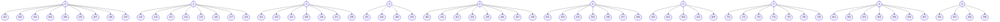

# Living System Map

This diagram shows all digit directories and their interactions.

```mermaid
graph TD
  0([0])
  1([1])
  2([2])
  3([3])
  4([4])
  5([5])
  6([6])
  7([7])
  8([8])
  9([9])
  0 --> 0_1[0/1]
  0_1([0/1])
  0 --> 0_2[0/2]
  0_2([0/2])
  0 --> 0_3[0/3]
  0_3([0/3])
  0 --> 0_4[0/4]
  0_4([0/4])
  0 --> 0_5[0/5]
  0_5([0/5])
  0 --> 0_6[0/6]
  0_6([0/6])
  0 --> 0_7[0/7]
  0_7([0/7])
  0 --> 0_8[0/8]
  0_8([0/8])
  0 --> 0_9[0/9]
  0_9([0/9])
  1 --> 1_0[1/0]
  1_0([1/0])
  1 --> 1_2[1/2]
  1_2([1/2])
  1 --> 1_3[1/3]
  1_3([1/3])
  1 --> 1_4[1/4]
  1_4([1/4])
  1 --> 1_5[1/5]
  1_5([1/5])
  1 --> 1_6[1/6]
  1_6([1/6])
  1 --> 1_7[1/7]
  1_7([1/7])
  1 --> 1_8[1/8]
  1_8([1/8])
  2 --> 2_1[2/1]
  2_1([2/1])
  2 --> 2_3[2/3]
  2_3([2/3])
  2 --> 2_4[2/4]
  2_4([2/4])
  2 --> 2_5[2/5]
  2_5([2/5])
  2 --> 2_6[2/6]
  2_6([2/6])
  2 --> 2_7[2/7]
  2_7([2/7])
  2 --> 2_8[2/8]
  2_8([2/8])
  3 --> 3_1[3/1]
  3_1([3/1])
  3 --> 3_4[3/4]
  3_4([3/4])
  3 --> 3_6[3/6]
  3_6([3/6])
  3 --> 3_9[3/9]
  3_9([3/9])
  4 --> 4_0[4/0]
  4_0([4/0])
  4 --> 4_1[4/1]
  4_1([4/1])
  4 --> 4_2[4/2]
  4_2([4/2])
  4 --> 4_3[4/3]
  4_3([4/3])
  4 --> 4_5[4/5]
  4_5([4/5])
  4 --> 4_6[4/6]
  4_6([4/6])
  4 --> 4_7[4/7]
  4_7([4/7])
  4 --> 4_8[4/8]
  4_8([4/8])
  5 --> 5_1[5/1]
  5_1([5/1])
  5 --> 5_2[5/2]
  5_2([5/2])
  5 --> 5_3[5/3]
  5_3([5/3])
  5 --> 5_4[5/4]
  5_4([5/4])
  5 --> 5_6[5/6]
  5_6([5/6])
  5 --> 5_7[5/7]
  5_7([5/7])
  5 --> 5_8[5/8]
  5_8([5/8])
  6 --> 6_0[6/0]
  6_0([6/0])
  6 --> 6_1[6/1]
  6_1([6/1])
  6 --> 6_3[6/3]
  6_3([6/3])
  6 --> 6_4[6/4]
  6_4([6/4])
  6 --> 6_9[6/9]
  6_9([6/9])
  7 --> 7_1[7/1]
  7_1([7/1])
  7 --> 7_2[7/2]
  7_2([7/2])
  7 --> 7_3[7/3]
  7_3([7/3])
  7 --> 7_4[7/4]
  7_4([7/4])
  7 --> 7_5[7/5]
  7_5([7/5])
  7 --> 7_6[7/6]
  7_6([7/6])
  7 --> 7_8[7/8]
  7_8([7/8])
  8 --> 8_1[8/1]
  8_1([8/1])
  8 --> 8_2[8/2]
  8_2([8/2])
  8 --> 8_3[8/3]
  8_3([8/3])
  8 --> 8_4[8/4]
  8_4([8/4])
  8 --> 8_5[8/5]
  8_5([8/5])
  8 --> 8_6[8/6]
  8_6([8/6])
  8 --> 8_7[8/7]
  8_7([8/7])
  9 --> 9_1[9/1]
  9_1([9/1])
  9 --> 9_3[9/3]
  9_3([9/3])
  9 --> 9_4[9/4]
  9_4([9/4])
  9 --> 9_6[9/6]
  9_6([9/6])
```
